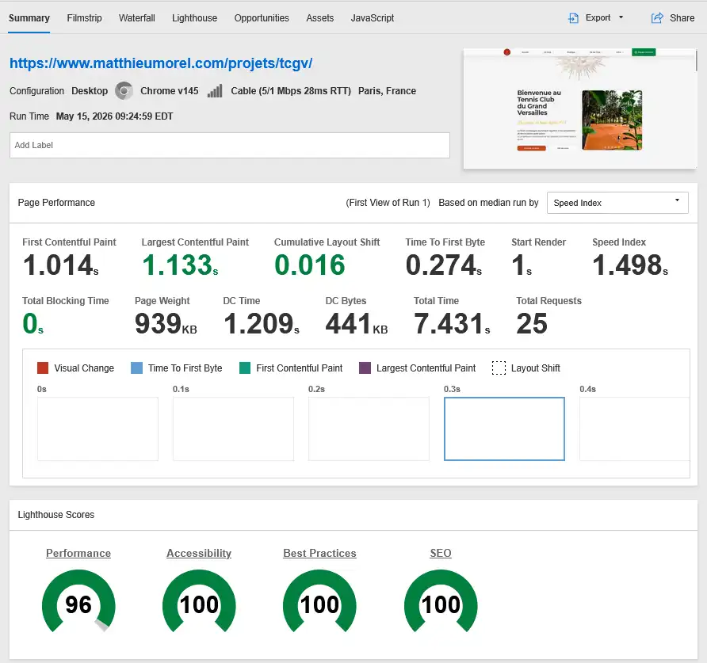
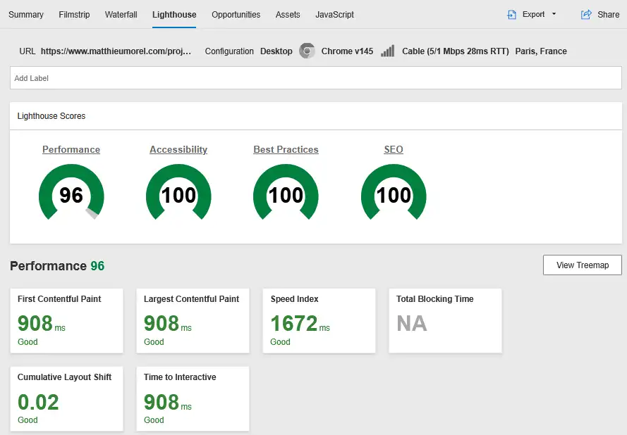
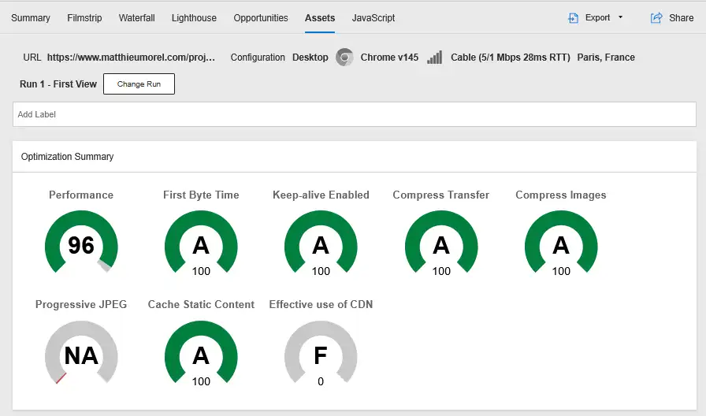
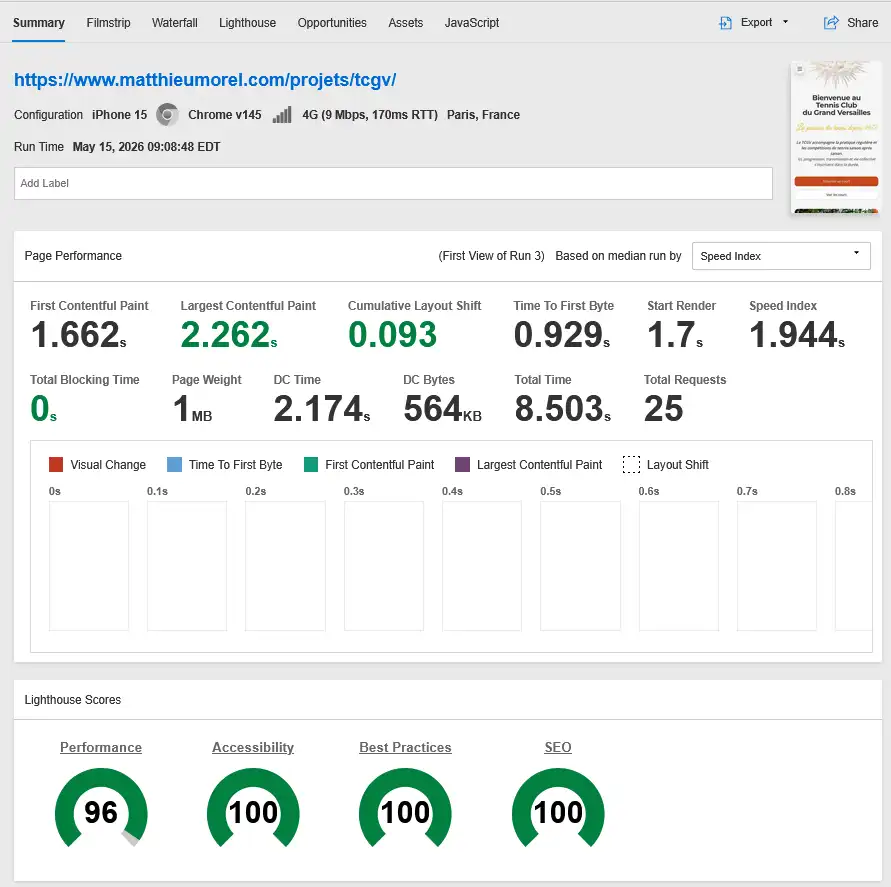

# 🎾 TCGV — Tennis Club du Grand Versailles

Site vitrine du Tennis Club du Grand Versailles, conçu avec une approche orientée performance, accessibilité et expérience utilisateur.

## 🌐 Démo

👉 https://www.matthieumorel.com/projets/tcgv

---

## ✨ Aperçu

Le site permet de :

- Découvrir les activités et cours proposés par le club
- Consulter les actualités et événements
- Explorer les infrastructures et équipes
- Parcourir une boutique (catalogue produits)
- Accéder aux informations pratiques (tarifs, règlement, contact)

L’ensemble est pensé pour une navigation fluide, mobile-first, avec un minimum de JavaScript côté client.

---

## 🚀 Stack technique

- Astro (Static Site Generator)
- Tailwind CSS v4
- React Islands (interactivité ciblée uniquement)
- Flowbite (composants interactifs JS, ex : carousel)

---

## 📊 Performance & Metrics

Le projet a été conçu avec une attention particulière portée aux performances frontend, aux Core Web Vitals, à l’accessibilité et à la sobriété de chargement.

Validation réalisée avec :

- Lighthouse
- PageSpeed Insights
- WebPageTest

Résultats observés sur environnement réel de test (desktop & mobile) :

- Lighthouse : 96–100 selon configuration et réseau
- Core Web Vitals dans les seuils “Good”
- JavaScript client limité grâce à l’architecture Astro + React Islands
- Temps de chargement et stabilité visuelle optimisés (LCP / CLS)

### WebPageTest — Summary



### Lighthouse Audit



### Asset Optimization



### Mobile Performance (4G)

Tests réalisés sur profil mobile simulé (iPhone 15 / 4G).

- Lighthouse Performance : 96
- Accessibility / Best Practices / SEO : 100
- LCP ≈ 2.26s
- CLS ≈ 0.09
- Total Blocking Time : 0ms



---

## ⚙️ Prérequis

- Node.js ≥ 20
- npm ≥ 10

---

## 📦 Installation

```bash
npm install
```

---

## 🧪 Développement

```bash
npm run dev
```

---

## 🏗️ Build production

```bash
npm run build
```

---

## 📁 Structure du projet (simplifiée)

```text
src/
  components/    → composants UI et sections
  layouts/       → layout global
  pages/         → routes Astro
  data/          → contenu structuré (single source of truth)
  assets/        → styles, images, scripts

public/          → assets statiques
```

---

## 🎯 Objectifs du projet

- Performance (SSG + JS minimal)
- Design system cohérent (TCGV)
- Accessibilité et responsive design
- Architecture frontend modulaire et maintenable

---

## ⚠️ Notes

- Le projet inclut volontairement des **flows simulés** (connexion, inscription, contact)
- Certaines interactions utilisateur sont simulées côté client et ne reposent pas sur un backend réel
- Cette approche est intentionnelle pour un projet vitrine statique

---

## 🧩 Configuration

Le site utilise une URL configurable via variables d’environnement :

```bash
PUBLIC_SITE_URL=https://www.matthieumorel.com/projets/tcgv
```

---

## 📄 Licence

Ce projet est distribué sous licence MIT. Voir le fichier `LICENSE`.
