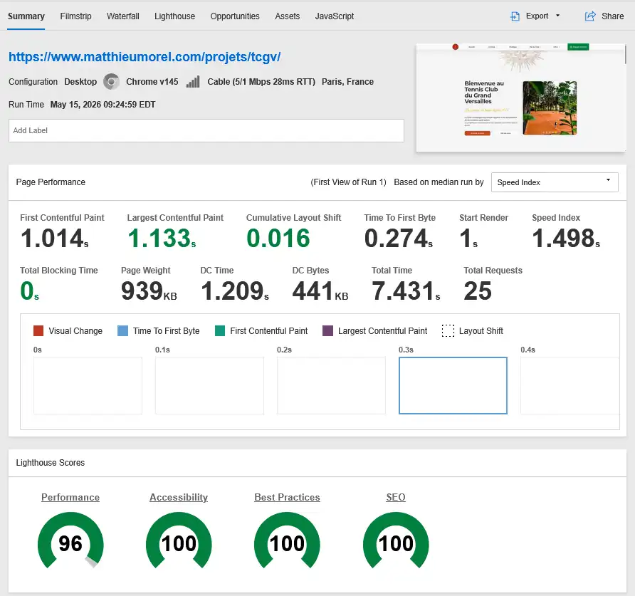
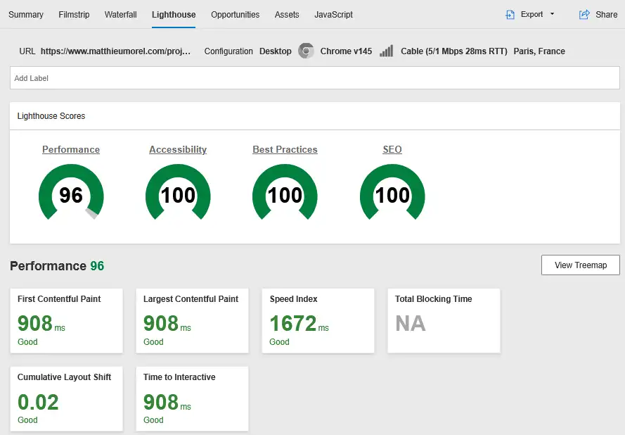
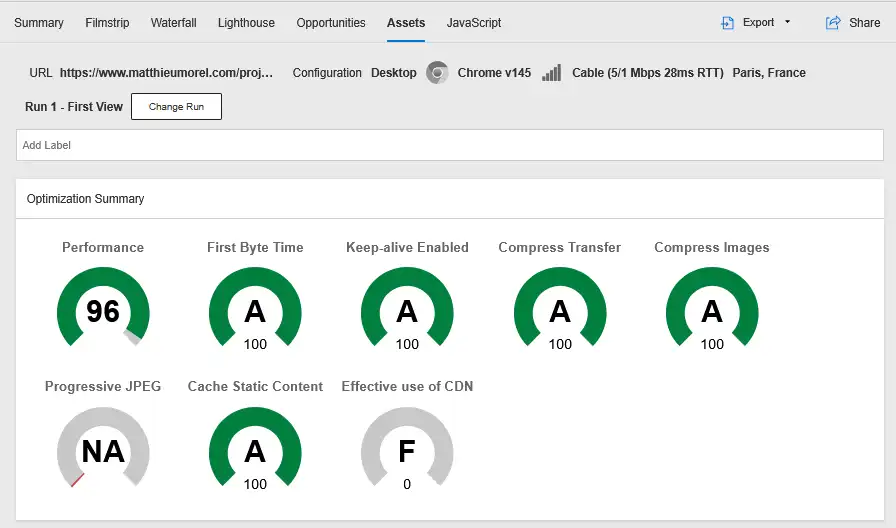

# 🎾 TCGV — Tennis Club du Grand Versailles

Site vitrine du Tennis Club du Grand Versailles, conçu avec une approche orientée performance, accessibilité et expérience utilisateur.

## 🌐 Démo

👉 https://www.matthieumorel.com/projets/tcgv

---

## ✨ Aperçu

Le site permet de :

- Découvrir les activités et cours proposés par le club
- Consulter les actualités et événements
- Explorer les infrastructures et équipes
- Parcourir une boutique (catalogue produits)
- Accéder aux informations pratiques (tarifs, règlement, contact)

L’ensemble est pensé pour une navigation fluide, mobile-first, avec un minimum de JavaScript côté client.

---

## 🚀 Stack technique

- Astro (Static Site Generator)
- Tailwind CSS v4
- React Islands (interactivité ciblée uniquement)
- Flowbite (composants interactifs JS, ex : carousel)

---

## 📊 Performance & Metrics

Le projet a été conçu avec une attention particulière portée aux performances frontend, aux Core Web Vitals, à l’accessibilité et à la sobriété de chargement.

Validation réalisée avec :

- Lighthouse
- PageSpeed Insights
- WebPageTest

Résultats observés sur environnement réel de test (desktop & mobile) :

- Lighthouse : 96–100 selon configuration et réseau
- Core Web Vitals dans les seuils “Good”
- JavaScript client limité grâce à l’architecture Astro + React Islands
- Temps de chargement et stabilité visuelle optimisés (LCP / CLS)

### WebPageTest — Summary



### Lighthouse Audit



### Asset Optimization



### Mobile Performance (4G)

Tests réalisés sur profil mobile simulé (iPhone 15 / 4G).

- Lighthouse Performance : 96
- Accessibility / Best Practices / SEO : 100
- LCP ≈ 2.26s
- CLS ≈ 0.09
- Total Blocking Time : 0ms


---

## Dernières évolutions

### v0.2.2 - Refactorisation du fil d’actualités

La version `v0.2.2` poursuit la structuration progressive des islands React avec une refactorisation interne du fil d’actualités.

Le composant principal `NewsFeed`, auparavant plus dense, a été réorganisé autour de responsabilités plus claires :

- synchronisation entre l’état de l’interface et l’URL ;
- parsing et sérialisation des paramètres de recherche ;
- gestion de la catégorie, de la recherche et de la pagination ;
- filtrage des actualités par catégorie et recherche texte ;
- sélection de l’actualité mise en avant ;
- calcul des résultats paginés ;
- extraction des contrôles, cartes d’articles, article mis en avant et pagination ;
- stabilisation du viewport lors des changements de résultats.

Cette évolution améliore la lisibilité et la maintenabilité du code sans modifier l’expérience utilisateur existante.

La gestion de la pagination a été fiabilisée afin d’éviter qu’une page invalide ou hors limites reste visible dans l’URL lorsque le nombre de résultats change. L’état affiché et les paramètres d’URL restent ainsi cohérents.

Les helpers liés à l’URL et aux résultats ont été isolés afin de rendre la logique plus explicite et plus facilement vérifiable. La recherche, la catégorie active, la page courante et les résultats affichés sont désormais mieux séparés du rendu visuel.

Une logique de stabilisation du viewport a également été ajoutée ou mutualisée afin d’éviter des sauts de scroll ou des variations d’affichage non souhaitées lors des recherches, changements de catégorie ou changements de page.

Cette refactorisation reste volontairement raisonnable : elle n’introduit pas de Context, de `useReducer` ou d’abstraction globale inutile. Les extractions restent ciblées sur le périmètre du fil d’actualités.

La branche publique reste volontairement centrée sur une version stable, reproductible et cohérente du projet. Les validations techniques et artefacts de développement sont intégrés uniquement lorsqu’ils sont pleinement alignés avec l’état de release publié.

### v0.2.1 - Refactorisation du catalogue boutique

La version `v0.2.1` poursuit le travail de structuration du code avec une refactorisation interne du catalogue boutique.

Le composant React principal `ShopCatalog`, auparavant plus monolithique, a été découpé en responsabilités plus claires :

- orchestration générale du catalogue ;
- contrôles de filtre, recherche et tri ;
- affichage du nombre de résultats, de la grille produits et de l’état vide ;
- synchronisation entre l’état de l’interface et l’URL ;
- helpers dédiés au filtrage et au tri des produits ;
- configuration typée du catalogue boutique.

Cette évolution améliore la lisibilité et la maintenabilité du code sans modifier l’expérience utilisateur existante.

La gestion des catégories produits a également été clarifiée en s’appuyant directement sur le type `ProductCategory`, afin d’éviter des alias spécifiques inutiles.

Une optimisation a été ajoutée pour stabiliser le viewport lors des recherches et filtrages dans la boutique. Elle permet d’éviter des sauts de scroll ou des affichages non souhaités lorsque la hauteur de la grille de résultats varie.

L’état de pagination est désormais préparé en interne pour une future évolution, sans être encore exposé dans l’interface publique.

La branche publique reste volontairement centrée sur une version stable, reproductible et cohérente du projet. Les validations techniques et artefacts de développement sont intégrés uniquement lorsqu’ils sont pleinement alignés avec l’état de release publié.

### v0.2 - Refactorisation du tunnel d’inscription

La version `v0.2` améliore la structure interne du tunnel d’inscription React.

Le composant principal `SubscriptionFlow.tsx` a été allégé et transformé en orchestrateur plus déclaratif, avec une séparation plus claire entre les composants de rendu, les helpers et la logique du flow via `useSubscriptionFlow`.

Cette évolution améliore la lisibilité et la maintenabilité du code tout en conservant le comportement utilisateur, le design Tailwind et les attributs d’accessibilité existants.

La branche publique reste volontairement centrée sur une version stable, reproductible et cohérente du projet.

---

## ⚙️ Prérequis

- Node.js ≥ 20
- npm ≥ 10

---

## 📦 Installation

```bash
npm install
```

---

## 🧪 Développement

```bash
npm run dev
```

---

## 🏗️ Build production

```bash
npm run build
```

---

## 📁 Structure du projet (simplifiée)

```text
src/
  components/    → composants UI et sections
  layouts/       → layout global
  pages/         → routes Astro
  data/          → contenu structuré (single source of truth)
  assets/        → styles, images, scripts

public/          → assets statiques
```

---

## 🎯 Objectifs du projet

- Performance (SSG + JS minimal)
- Design system cohérent (TCGV)
- Accessibilité et responsive design
- Architecture frontend modulaire et maintenable

---

## ⚠️ Notes

- Le projet inclut volontairement des **flows simulés** (connexion, inscription, contact)
- Certaines interactions utilisateur sont simulées côté client et ne reposent pas sur un backend réel
- Cette approche est intentionnelle pour un projet vitrine statique

---

## 🧩 Configuration

Le site utilise une URL configurable via variables d’environnement :

```bash
PUBLIC_SITE_URL=https://www.matthieumorel.com/projets/tcgv
```

---

## 📄 Licence

Ce projet est distribué sous licence MIT. Voir le fichier `LICENSE`.
